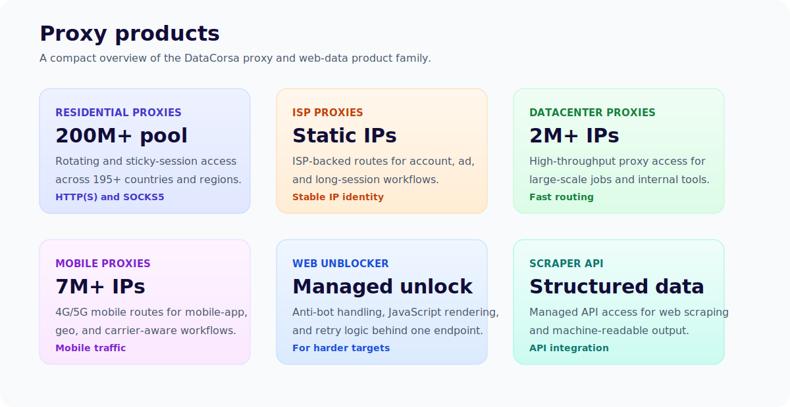
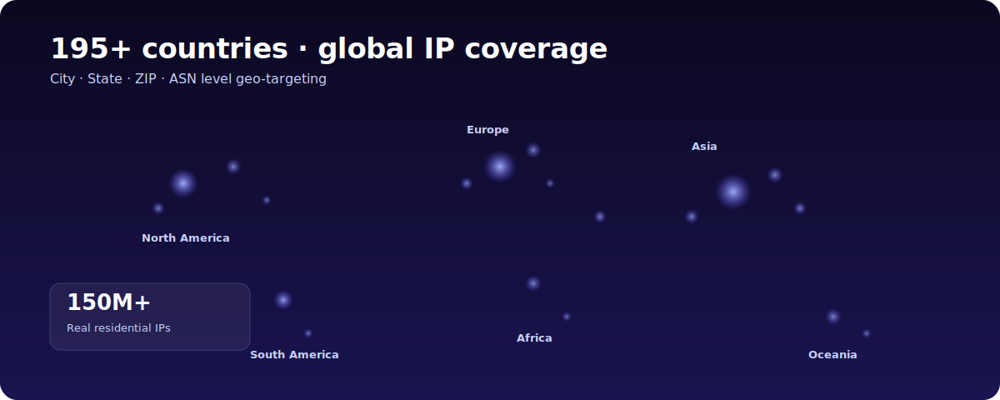

<p align="center">
  <a href="https://www.datacorsa.com/"></a>
</p>

<h1 align="center">DataCorsa Proxy Examples</h1>

<p align="center">
Code samples for sending requests through <a href="https://www.datacorsa.com/">DataCorsa</a> HTTP(S) and SOCKS5 proxy gateways.
</p>

## Table of Contents

- [What is DataCorsa?](#what-is-datacorsa)
- [Getting started](#getting-started)
- [Proxy gateways](#proxy-gateways)
- [Quick example](#quick-example)
- [Products](#products)
- [Locations](#locations)
- [Integrations](#integrations)
- [License](#license)
- [Contact](#contact)

## What is DataCorsa?

[DataCorsa](https://www.datacorsa.com/) currently provides three proxy products: Residential Proxies, Datacenter Proxies, and Mobile Proxies. This repository covers HTTP(S) and SOCKS5 gateway examples for those available products.

This repository is a compact integration reference. It keeps the examples focused on the gateway, credentials, and client configuration needed to make a first proxied request.

## Getting started

1. Request access or contact the DataCorsa team at [datacorsa.com](https://www.datacorsa.com/en/contact/).
2. Get your proxy username and password, or configure IP whitelist authentication if it is enabled for your plan.
3. Choose the HTTP(S) or SOCKS5 gateway for your client.
4. Set the credentials in the example for your language and run the IP-check request.

## Proxy gateways

| Mode | Endpoint | Typical use |
| --- | --- | --- |
| HTTP(S) proxy | `https://gw.datacorsa.com:11443` | HTTP clients that support HTTPS proxy URLs |
| SOCKS5 proxy | `gw.datacorsa.com:11444` | Clients that need SOCKS5 support or remote DNS resolution |
| Test URL | `https://ip.datacorsa.com/json` | Quick check that the request exits through DataCorsa |

The `https://` scheme on the HTTP(S) proxy endpoint is intentional. It means the client connects to the proxy gateway over TLS before tunneling the target request.

If your DataCorsa account provides a different host, port, username format, or test URL, use the account-specific values in place of the placeholders shown here.

## Quick example

Test your credentials with `curl`:

```bash
# HTTP(S) proxy
curl --proxy https://gw.datacorsa.com:11443 \
  --proxy-user "username:password" \
  https://ip.datacorsa.com/json

# SOCKS5 proxy
curl --socks5-hostname gw.datacorsa.com:11444 \
  --proxy-user "username:password" \
  https://ip.datacorsa.com/json
```

If the gateway is reachable and your credentials are valid, the response should show the exit IP and related location metadata.

## Products

<p align="center">
  
</p>

- [Residential Proxies](https://www.datacorsa.com/en/products/residential-proxies/) - 200M+ real residential IPs for zero-ban risk data collection.
- [Datacenter Proxies](https://www.datacorsa.com/en/products/datacenter-proxies/) - 2M+ datacenter IPs, sub-second response, 70% lower cost.
- [Mobile Proxies](https://www.datacorsa.com/en/products/mobile-proxies/) - real 4G/5G device IPs for the highest level of anonymity.

## Locations

DataCorsa lists coverage across 195+ countries and regions, with country, city, and ZIP-code targeting described on the public site. See [Global Proxy Nodes](https://www.datacorsa.com/en/resources/global-proxies/) for the current coverage page.

<p align="center">
  
</p>

## Integrations

Each subdirectory includes a small source file and README for one language or runtime:

- [Bash / cURL](./shell)
- [C#](./csharp)
- [Go](./golang)
- [Java](./java)
- [Node.js](./nodejs) - HTTP(S) and SOCKS5
- [PHP](./php) - HTTP(S) and SOCKS5
- [Python](./python) - HTTP(S) and SOCKS5
- [Ruby](./ruby)

Use the example closest to your runtime and replace the placeholder credentials with your DataCorsa account values.

## License

All code in this repository is released under the [MIT License](./LICENSE).

## Contact

- Website: [https://www.datacorsa.com/](https://www.datacorsa.com/)
- Contact: [https://www.datacorsa.com/en/contact/](https://www.datacorsa.com/en/contact/)
- Email: [datacorsa.service@gmail.com](mailto:datacorsa.service@gmail.com)
- Docs: [https://www.datacorsa.com/en/resources/docs/](https://www.datacorsa.com/en/resources/docs/)
